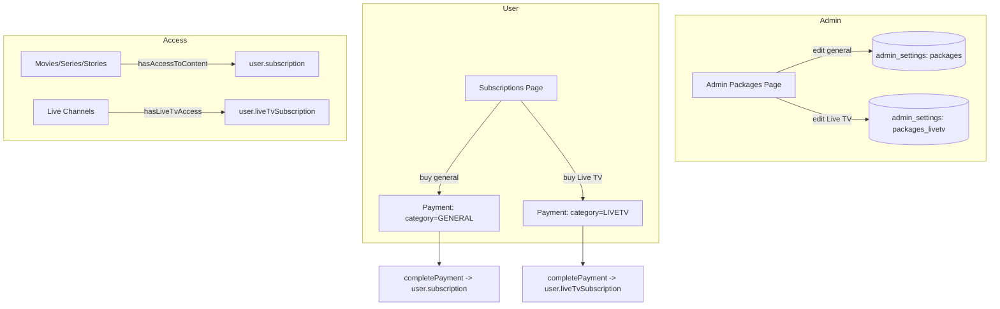

# Design Document

## Overview

We add a **second, independent package set for Live TV** while leaving the existing package system untouched for movies, series, and stories. Concretely:

- Package configs are stored in `admin_settings` (key-value). The existing `packages` row stays as the **general/movie** set. We add a new row `packages_livetv` for the **Live TV** set.
- Users gain a **separate Live TV subscription** stored independently from their existing subscription.
- Live channel access checks use the Live TV subscription; everything else keeps using the existing subscription.
- Payments are tagged with a **category** so completion activates the correct subscription.

This keeps the change additive and low-risk: nothing about movies/series/stories changes.

### Confirmed decisions
- Live TV requires its **own separate purchase** by the user. (Confirmed.)

### Assumption pending confirmation
- **Migration:** When the split goes live, existing active subscribers are granted **Live TV access for the remaining days of their current subscription** (a one-time transition courtesy). After that period they must buy a Live TV package. This avoids locking current users out of channels overnight. Confirm or change.

## Architecture



## Components and Interfaces

### 1. Data model

**`src/types/index.ts`**

- Add a category type:
  ```ts
  export type PackageCategory = 'GENERAL' | 'LIVETV';
  ```
- Extend `User` with an independent Live TV subscription (mirrors existing fields):
  ```ts
  liveTvSubscription?: UserSubscription | null;
  liveTvSubscriptionHistory?: UserSubscription[];
  ```
- Extend `UserSubscription` with an optional category for clarity:
  ```ts
  category?: PackageCategory; // defaults to 'GENERAL' when absent
  ```
- Extend `PaymentRequest` with the category (additive, backward compatible):
  ```ts
  packageCategory?: PackageCategory; // 'LIVETV' for live TV purchases; absent/GENERAL otherwise
  ```

### 2. Storage

- **Live TV package config** lives in `admin_settings` row `id = 'packages_livetv'`, `data` = JSON map (same shape as the existing `packages` row).
- **User Live TV subscription**: add nullable columns to `rahapremium_users`:
  - `live_tv_subscription text`
  - `live_tv_subscription_history text`
  Stored as JSON strings, matching how `subscription` / `subscription_history` are handled today.
- A new migration file under `supabase/migrations/` adds these columns (idempotent `ADD COLUMN IF NOT EXISTS`). No backfill required; absent = no Live TV subscription.

### 3. Subscriptions library (`src/lib/subscriptions.ts`)

- Add defaults: `LIVETV_SUBSCRIPTION_PACKAGES` = a copy of the regular packages (FEDHA, CHUMA, DHAHABU, ALMASI, MALKIA) with identical prices/days/names.
- Add config accessors that mirror the existing ones but target the `packages_livetv` row:
  - `getLiveTvPackagesConfig(): Promise<PackagesConfigMap>`
  - `updateLiveTvPackageConfig(packageType, updates)`
- Generalize the underlying read/write to accept a settings key, so general and Live TV share the same battle-tested logic without touching each other:
  - `getPackagesConfigByKey(key, defaults)` and `updatePackageConfigByKey(key, defaults, packageType, updates)`.
  - Existing `getPackagesConfig` / `updatePackageConfig` keep their signatures and delegate to the `'packages'` key (no behavior change).
- Add a Live TV access helper:
  ```ts
  export const hasLiveTvAccess = (user, requiredPackages) => { /* same rules as hasAccessToContent but reads user.liveTvSubscription */ }
  ```
  Including the transition rule: if there is no active `liveTvSubscription` but there is an active general `subscription` whose end date is in the future, grant access (transition courtesy) — gated behind a flag so it can be turned off after the transition window.
- Add a Live TV status helper:
  ```ts
  export const getUserLiveTvSubscriptionStatus(user) // mirrors getUserSubscriptionStatus, reads liveTvSubscription
  ```
- Update `initiatePayment` and the subscription-processing path to accept a `category` and, for `LIVETV`, write to `live_tv_subscription` instead of `subscription`. Renewal/upgrade carry-over logic is reused but scoped to the matching category's current subscription.

### 4. Payment completion / webhook

- `completePayment` (and the webhook path that activates subscriptions) reads `packageCategory` from the payment record. For `LIVETV` it activates/updates `user.liveTvSubscription`; otherwise it behaves exactly as today.
- The Live TV price for a payment is read from `getLiveTvPackagesConfig()`, not the general config.

### 5. Admin packages page (`src/app/admin/packages/page.tsx`)

- Load both configs: existing general config and the new Live TV config.
- Add a third section "Live TV Packages" (icon: e.g. `Tv`) below the existing Subscription and Game sections.
- Reuse the existing `renderPackageCard` UI; saving a Live TV card calls `updateLiveTvPackageConfig`, leaving the general save path unchanged. This guarantees "edit one, only that one changes."

### 6. Subscriptions page (`src/app/subscriptions/page.tsx`)

- Load `getLiveTvPackagesConfig()` in addition to the existing config.
- Add a dedicated "Live TV" section listing Live TV packages with their own Subscribe buttons.
- Show Live TV subscription status (active / days remaining / expiry) separately via `getUserLiveTvSubscriptionStatus`.
- The subscribe flow passes `category: 'LIVETV'` into `initiatePayment`; the payment modal states the user is paying for Live TV.
- The existing packages section and its flow remain unchanged (`category` defaults to `GENERAL`).

### 7. Live TV access enforcement (`src/app/live-tv/page.tsx`)

- Replace the channel access check `hasAccessToContent(user, channel.requiredPackages)` with `hasLiveTvAccess(user, channel.requiredPackages)`.
- Free-channel and `liveTvAllFree` behavior is unchanged.
- The "subscribe to watch" CTA routes to the Live TV section of the subscriptions page.

## Data Models

### Live TV package config (admin_settings row `packages_livetv`)
```json
{
  "FEDHA":   { "days": 3,   "price": 5000,   "name": "FEDHA" },
  "CHUMA":   { "days": 7,   "price": 8000,   "name": "CHUMA" },
  "DHAHABU": { "days": 14,  "price": 15000,  "name": "DHAHABU" },
  "ALMASI":  { "days": 30,  "price": 25000,  "name": "ALMASI" },
  "MALKIA":  { "days": 180, "price": 120000, "name": "MALKIA" }
}
```

### User Live TV subscription (column `live_tv_subscription`, JSON)
Same shape as the existing `subscription` JSON, with `category: 'LIVETV'`.

## Error Handling

- If `packages_livetv` row is missing, accessors fall back to `LIVETV_SUBSCRIPTION_PACKAGES` defaults (same pattern as today's general config fallback).
- If the Live TV subscription columns are missing (pre-migration), reads treat them as `null` (no Live TV subscription) and writes are skipped with a logged warning, so the app never crashes mid-deploy.
- Payment completion validates `packageCategory`; unknown values default to `GENERAL` to preserve current behavior.

## Correctness Properties

### Property 1: Set isolation
Writing to the Live TV config (`packages_livetv`) never reads from or mutates the general config (`packages`), and vice versa.

**Validates: Requirements 1.3, 2.4**

### Property 2: Subscription isolation
A `LIVETV` payment only ever creates/updates `live_tv_subscription`; a `GENERAL` payment only ever creates/updates `subscription`.

**Validates: Requirements 3.2, 3.3**

### Property 3: Access correctness
A live channel is accessible iff it is free/`liveTvAllFree`, OR the user has an active Live TV subscription covering its `requiredPackages`, OR (during the transition window) the user has an active general subscription.

**Validates: Requirements 4.1, 4.3, 5.2**

### Property 4: Non-regression
For movies/series/stories, access and the subscription/payment flow produce the same results as before this feature.

**Validates: Requirements 1.5, 4.2, 5.1**

### Property 5: Safe fallback
Missing `packages_livetv` row or missing Live TV columns degrade to defaults / no Live TV subscription without throwing.

**Validates: Requirements 1.2, 5.3**

## Testing Strategy

- **Unit**: `hasLiveTvAccess` (no sub, active sub, expired sub, transition-courtesy path, free channel); `getLiveTvPackagesConfig` fallback; category-scoped renewal/upgrade carry-over.
- **Isolation**: saving a Live TV package updates only `packages_livetv`; saving a general package updates only `packages` (assert the other row is byte-for-byte unchanged).
- **Payment flow**: a `LIVETV` payment activates `live_tv_subscription` and never mutates `subscription`, and vice versa.
- **Migration**: existing active subscriber can watch channels during the transition window; after expiry, channels require a Live TV purchase.
- **Regression**: movies/series/stories access and the existing subscription/payment flow are unchanged.

## Rollout / Migration Notes

1. Apply the DB migration (new columns; new settings row created lazily on first save or seeded with defaults).
2. Deploy code; Live TV config defaults to a copy of current packages, so prices look identical on day one.
3. Transition courtesy flag ON during the window so current subscribers keep channel access; turn OFF when the window ends.
