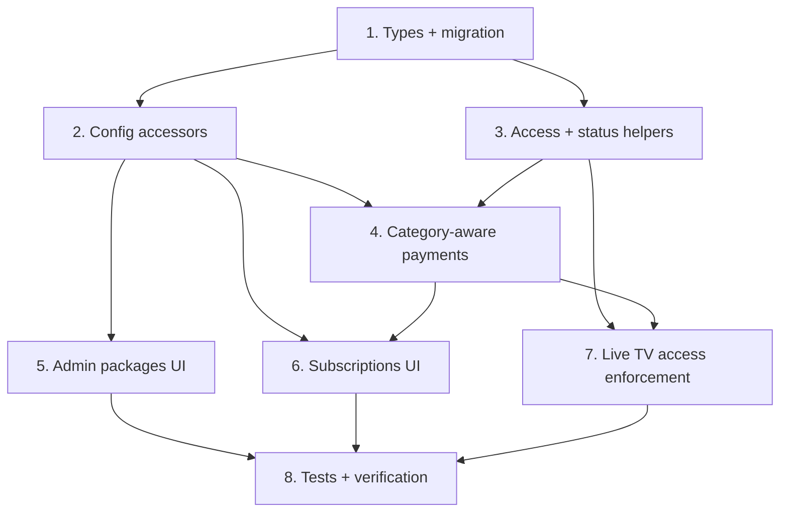

# Implementation Plan

## Overview

This plan adds an independent Live TV package set without changing the existing movie/series/story package behavior. Work proceeds bottom-up: types and storage first, then access/payment logic, then the admin and user UI, then verification.

## Task Dependency Graph

```json
{
  "waves": [
    { "wave": 1, "tasks": ["1"] },
    { "wave": 2, "tasks": ["2", "3"] },
    { "wave": 3, "tasks": ["4", "5"] },
    { "wave": 4, "tasks": ["6", "7"] },
    { "wave": 5, "tasks": ["8"] }
  ]
}
```



## Tasks

- [x] 1. Add types and a database migration for the Live TV package set
  - Add `PackageCategory` type, `liveTvSubscription` / `liveTvSubscriptionHistory` on `User`, optional `category` on `UserSubscription`, and optional `packageCategory` on `PaymentRequest` in `src/types/index.ts`.
  - Create a migration in `supabase/migrations/` adding `live_tv_subscription` and `live_tv_subscription_history` text columns to `rahapremium_users` using `ADD COLUMN IF NOT EXISTS`.
  - _Requirements: 1.1, 1.3, 3.2, 5.1_

- [x] 2. Generalize package-config storage and add Live TV config accessors
  - Refactor `getPackagesConfig` / `updatePackageConfig` in `src/lib/subscriptions.ts` to delegate to key-based helpers `getPackagesConfigByKey('packages', ...)` / `updatePackageConfigByKey('packages', ...)` with no behavior change.
  - Add `LIVETV_SUBSCRIPTION_PACKAGES` defaults (copy of the regular packages) and `getLiveTvPackagesConfig` / `updateLiveTvPackageConfig` targeting the `packages_livetv` settings row.
  - _Requirements: 1.1, 1.2, 1.3, 2.2, 2.3, 2.4_

- [x] 3. Add Live TV access and status helpers
  - Implement `hasLiveTvAccess(user, requiredPackages)` reading `user.liveTvSubscription`, including the transition-courtesy path behind a flag.
  - Implement `getUserLiveTvSubscriptionStatus(user)` mirroring `getUserSubscriptionStatus`.
  - _Requirements: 4.1, 4.3, 5.2_

- [x] 4. Make payment initiation and completion category-aware
  - Extend `initiatePayment` to accept a `category` and persist `packageCategory` on the payment; read Live TV price from `getLiveTvPackagesConfig` when category is `LIVETV`.
  - Update the subscription-processing/`completePayment` path and the webhook activation to route `LIVETV` payments into `live_tv_subscription` (with category-scoped renewal/upgrade carry-over) and leave the general path unchanged.
  - _Requirements: 3.2, 3.3, 3.4, 4.1_

- [x] 5. Add the Live TV section to the admin packages page
  - In `src/app/admin/packages/page.tsx`, load the Live TV config, render a new "Live TV Packages" section reusing `renderPackageCard`, and wire its save action to `updateLiveTvPackageConfig` only.
  - Verify saving a Live TV card does not modify the general `packages` row and vice versa.
  - _Requirements: 2.1, 2.2, 2.3, 2.4, 6.1_

- [x] 6. Add the Live TV section to the user subscriptions page
  - In `src/app/subscriptions/page.tsx`, load `getLiveTvPackagesConfig`, render a separate Live TV packages section, and show Live TV status via `getUserLiveTvSubscriptionStatus`.
  - Pass `category: 'LIVETV'` through the subscribe/payment flow and label the payment modal as Live TV; keep the existing general flow unchanged.
  - _Requirements: 3.1, 3.5, 6.1, 6.3_

- [x] 7. Enforce Live TV access on the Live TV page
  - In `src/app/live-tv/page.tsx`, replace `hasAccessToContent(user, channel.requiredPackages)` with `hasLiveTvAccess(...)`, keeping free-channel and `liveTvAllFree` behavior intact.
  - Route the locked-channel CTA to the Live TV section of the subscriptions page.
  - _Requirements: 4.1, 4.3, 4.4_

- [ ] 8. Tests and verification
  - Unit tests for `hasLiveTvAccess` (no sub / active / expired / transition / free channel), config fallback, and category-scoped carry-over.
  - Isolation test: editing one package set leaves the other unchanged.
  - Payment test: a `LIVETV` payment activates only `live_tv_subscription`; a general payment activates only `subscription`.
  - Regression check: movies/series/stories access and the existing flow are unchanged.
  - _Requirements: 1.3, 2.4, 3.2, 3.3, 4.2, 5.1_

## Notes

- The general/movie package set, its config row (`packages`), and the existing subscription/payment flow are intentionally left unchanged.
- Live TV defaults are a copy of the current packages so prices appear identical on day one.
- The migration-courtesy access path is flag-gated so it can be disabled after the transition window.
